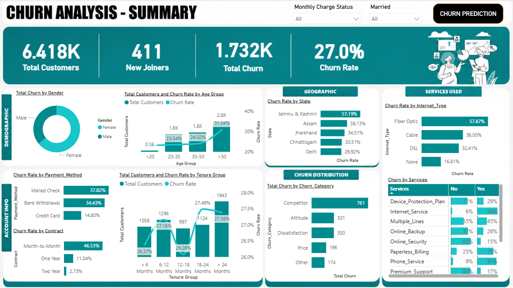
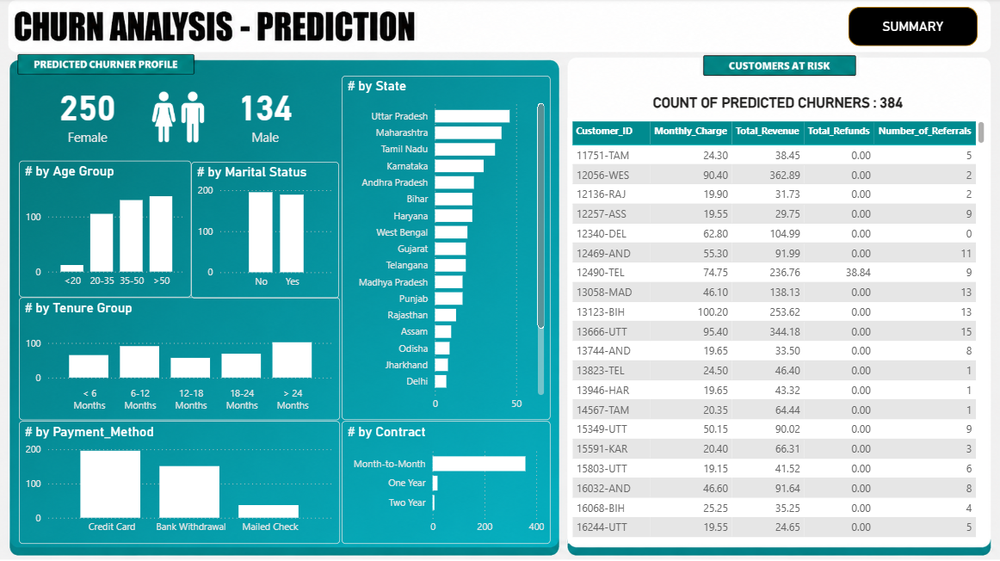

# Customer Churn Analysis & Prediction

<p align="center">
  
  
  
</p>

---

## 📌 Overview

This project analyzes telecom customer behavior to identify churn patterns and predict customers likely to leave the service. The solution combines **SQL**, **Python**, **Machine Learning**, and **Power BI** to deliver business insights and predictive analytics.

---

# 🎯 Problem Statement

Customer churn directly impacts business revenue and customer retention.

This project aims to:

- Analyze customer behavior patterns
- Identify key churn drivers
- Predict high-risk customers
- Build interactive dashboards for business decision-making

---

# 📂 Dataset

The dataset contains **7,000+ telecom customer records** including:

- Customer demographics
- Contract type
- Internet services
- Monthly charges
- Payment methods
- Tenure
- Churn status

---

# 🛠️ Tech Stack

<p align="left">
  
  
  
  
  
  
</p>

---

# ⚙️ Project Workflow

## 🔹 SQL ETL & Data Cleaning

- Checked distinct and null values
- Cleaned inconsistent records
- Built reporting views for Power BI

## 🔹 Exploratory Data Analysis

- Analyzed churn trends and customer behavior
- Performed preprocessing and feature selection

## 🔹 Machine Learning

- Built a **Random Forest Classifier**
- Predicted customer churn probability
- Evaluated model performance

## 🔹 Dashboard Development

Created interactive Power BI dashboards for:

- Customer Overview
- Churn Prediction

---

# 📊 Dashboard Preview

## 🔹 Summary Dashboard



---

## 🔹 Churn Prediction Dashboard



---

# 📈 Key Insights

- Higher churn observed among **month-to-month contract customers**
- Customers with **short tenure** showed increased churn probability
- Electronic check users had relatively higher churn rates
- Long-term contract customers showed stronger retention

---

# 🤖 Machine Learning Model

| Model | Purpose |
|---|---|
| Random Forest Classifier | Customer Churn Prediction |

### Techniques Used

- Label Encoding
- Feature Engineering
- Train-Test Split
- Feature Importance Analysis

---

# 📁 Project Structure

```bash
customer-churn-analysis-prediction/
│
├── data/
├── notebooks/
│   └── ml_churn_prediction.ipynb
│
├── sql/
│   ├── 01_Check_Distinct_Values.sql
│   ├── 02_Check_Null_Values.sql
│   ├── 03_ETL_Clean_And_Load_Prod_Table.sql
│   └── 04_Create_PowerBI_View.sql
│
├── powerbi/
│   └── Churn_Analysis.pbix
│
├── images/
│   ├── 01_Summary.png
│   └── 02_Churn_Prediction.png
│
└── README.md
```

---

# 🚀 Business Impact

This project helps businesses:

- Identify high-risk customers early
- Improve retention strategies
- Understand major churn drivers
- Support data-driven decisions

---

# 🔮 Future Improvements

- Deploy model using Streamlit
- Add real-time prediction capability
- Perform hyperparameter tuning
- Integrate cloud database connectivity

---

# 👨‍💻 Author & Contact

## Vishal Ramane

Data Analyst

📧 Email: vishalramane.work@gmail.com

🔗 LinkedIn: https://www.linkedin.com/in/vishal-ramane

🔗 GitHub: https://github.com/vishalramane
````
